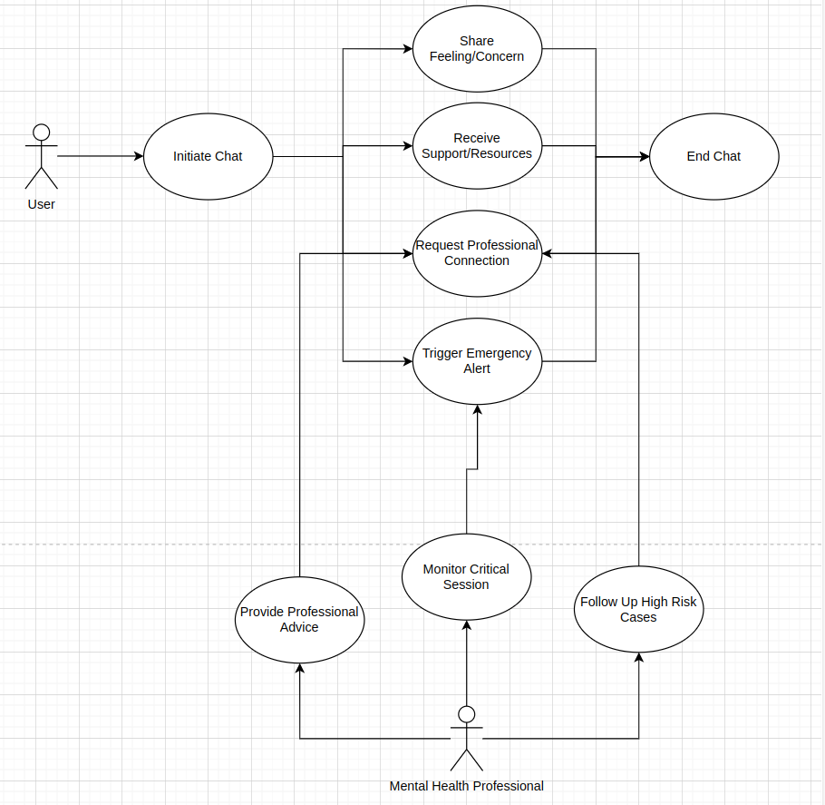

# NEXT
Sebuah produk untuk mempermudah kehidupan manusia khususnya dalam bidang teknologi \
Ketua Kelompok: Naufal Septio Fathurrahman - 22/502670/TK/54886  \
Anggota 1: PIJARWIDYANARA ANDHITA HERMAWAN - 22/503741/TK/55061 \
Anggota 2: Muhamad Daffa Azfa Rabbani - 22/503970/TK/55101

# SDLC
Metodologi pengembangan yang digunakan untuk aplikasi ini sendiri adalah waterfall, dengan alasan bahwa pengembangan dengan waterfall yang sederhana, dikarenakan prosedur pengerjaannya yang terstruktur, serta jadwal pengembangan yang jelas, serta requirement yang tidak sering berubah. \

# Tujuan
Produk sendiri adalah merupakan aplikasi Chatbot terkhusus untuk mental health, chatbotnya sendiri dapat memberikan nasihat kepada pengguna agar mereka mendapatkan. Calon pengguna dalam aplikasi ini terdapat banyak, seperti perusahaan yang membutuhkan aplikasi untuk mengecek kesehatan mental para karyawannya, atau juga sebatas pengguna biasa yang ingin untuk melakukan  curhat terhadap penggunanya

# Functional Requirement
| FR                    | Deskripsi                                                                                                                                                                                                                                    |
|------------------------|-----------------------------------------------------------------------------------------------------------------------------------------------------------------------------------------------------------------------------------------------|
| User Interaction       | User dapat berinteraksi dengan chatbot, via antarmuka web yang memiliki text input, chatbot tersebut kemudian dapat merespons sesuai dengan konteks yang diberikan pengguna dan memberi nasihat ataupun support yang sesuai dengan diinginkan. |
| Risk Assessment        | Chatbot dapat melakukan analisis terhadap chat kepada pengguna kemudian men eskalasi apabila ada yang berbahaya terhadap pengguna.                                                                    |
| Professional Support   | Sistem dapat mengeksekusi dan memberikan bantuan dengan support yang manusia dan lebih ahli ketika terdapat sebuah pengguna yang dianggap memiliki resiko.                                              |
# Use Case Diagram

# Wireframe

.png)

.png)
